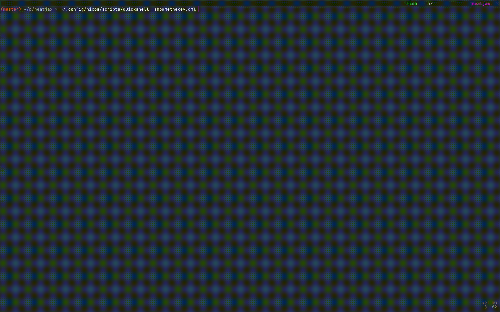

- [Goals](#goals)
- [Setup](#setup)
  - [Requirements](#requirements)
  - [Instructions](#instructions)
- [Extra setup: First time only (If you didn't restore from a backup)](#extra-setup-first-time-only-if-you-didnt-restore-from-a-backup)
  - [Secrets](#secrets)
  - [RSS feed](#rss-feed)
- [Other: Python per project setup](#other-python-per-project-setup)
  - [Patch libraries](#patch-libraries)
  - [Improve error messages](#improve-error-messages)
- [File structure](#file-structure)
- [Common pahts](#common-pahts)
- [Configuring programs (Stow)](#configuring-programs-stow)
- [Installing programs](#installing-programs)
- [Updating packages broadly](#updating-packages-broadly)
- [Upgrading/downgrading an specific package or pinning it to an specific version](#upgradingdowngrading-an-specific-package-or-pinning-it-to-an-specific-version)
- [Secrets](#secrets-1)
- [Backups](#backups)
- [Todo](#Todo)
- [For reference, things I tried before this](#for-reference-things-i-tried-before-this)

# Goals

- **Simple**: Minimize cognitive load, minimize configuration.
- **Effective**: Get close to the best developer experience available.
- **Reliable**: Favor well stablished technologies, favor software with less dependencies, favor lightweight, favor UNIX philosophy.
- **Reproducible**: Be able to set up the environment quickly.
- **Low maintance**: Do the configuration effort upfront.

# Setup

## Requirements

- 1 spare laptop that is not apple. (Apple setup differs, and I don't use their devices.)
- 1 usb.
- (Optional) Openrouter api key for aichat.
- (Optional) Claude pro subscription for claude-code.

## Instructions

1. Download the [official nixos graphical iso image.](https://nixos.org/download/).
2. Flash it to the usb:

```bash
sudo fdisk -l # Find the usb disk mount, e.g. /dev/sdb
# NOTE: It must be the whole disk and not a partition, e.g. /dev/sdb instead of /dev/sdb1
sudo umount /dev/sdb*
sudo dd bs=4M conv=fsync oflag=direct status=progress if=/home/nixos/Downloads/nixos-graphical-25.05.810859.20c4598c84a6-x86_64-linux.iso of=/dev/sdb
```

One alternative: https://etcher.balena.io/

3. Plug the usb into the spare laptop, boot it from the image. To display the option to do so, press F12 repeteadly after pressing the powerup button.

During the wizard:
- For desktop environment choose `minimal`.
- For `username` and `name` use `nixos`.
- For partitioning I've always used `erase all`, but other options might work.

4. Connect to wifi:

```bash
nmtui # Activate a connection -> Select the network -> Enter the password
```

5. Copy the config:

Option A)  If it is the first time, clone this repo into `~/.config/nixos`:

```bash
export NIX_CONFIG="experimental-features = nix-command flakes"
nix run nixpkgs#git -- clone "https://github.com/PbVrCt/dotfiles" "$HOME/.config/nixos"
```

Option B) If you have a backup from a previous setup, then restore it.

Plug the usb into the laptop and mount it:

```bash
export NIX_CONFIG="experimental-features = nix-command flakes"
nix run nixpkgs#bashmount # mount to /home/nixos/mnt/usb
```
    
Restore the backup:
```bash
REPO=/home/nixos/mnt/usb/restic-repo 
RESTORE_PATH="$HOME/restic-restored/"
nix run nixpkgs#restic -- restore latest -r "$REPO" --target "$RESTORE_PATH"
# config
mkdir /home/nixos/.config
cp $RESTORE_PATH/home/nixos/.config/nixos /home/nixos/.config/nixos -r
# other stuff: projects, notes, secrets key, the backup itself
cp $RESTORE_PATH/home/nixos/projects /home/nixos/projects -r
cp $RESTORE_PATH/home/nixos/notes /home/nixos/notes -r
cp $RESTORE_PATH/home/nixos/.config/sops_private_key.txt /home/nixos/.config/sops_private_key.txt
cp $REPO /home/nixos/restic-repo -r
sudo rm $RESTORE_PATH -r
```
6. Make scripts executable:
```bash
chmod +x /home/nixos/.config/nixos/scripts/**
chmod +x /home/nixos/.config/nixos/scripts_as_dotfiles/**
```
7. Symlink dotfiles:
```bash
nix-shell -p stow
/home/nixos/.config/nixos/scripts/stow.sh
exit
```

8. Add a new host at `host/$HOST/` following the existing examples.
```bash
HOST=vesuvio # Insert laptop brand / volcano name / battleship name etc.
mkdir /home/nixos/.config/nixos/hosts/$HOST -p
```
Copy whatever files your host might use, .e.g., `intel.nix`, `amd.nix`, `nvidia.nix`.
```bash
# For example: cp $HOME/.config/nixos/hosts/thinkpad/** $HOME/.config/nixos/hosts/$HOST/**
```

9. Copy the autogenerated hardware-configuration.nix file to the configuration folder.
```bash
sudo cp /etc/nixos/hardware-configuration.nix /home/nixos/.config/nixos/hosts/$HOST/hardware-configuration.nix 
```
> The hardware file changes after partitioning even if on the same machine. Don't skip this after a fresh reinstall.

10. Reference the host from the previous steps in `flake.nix`.
```bash
nix run nixpkgs#helix /home/nixos/.config/nixos/flake.nix
```

For example:
```nix
      vesuvio = inputs.nixpkgs.lib.nixosSystem {
        system = "x86_64-linux";
        modules = [
          ./configuration.nix
          ./base.nix
          inputs.sops-nix.nixosModules.sops
          inputs.schizofox.nixosModules.default
          ./hosts/vesuvio/hardware-configuration.nix
          ./hosts/vesuvio/intel.nix
        ];
      };
```

11. Change the timezone and hostname. In `base.nix`:


```nix
  config.time.timeZone = "Asia/Tokyo";

  # Networking
  config.networking = {
    hostName = "vesuvio";
```

```bash
nix run nixpkgs#helix /home/nixos/.config/nixos/base.nix
```


12. Rebuild the system.

>WARNING: This will download the programs the config specifies (~15GB):

```bash
nix-shell -p git
HOST=vesuvio # Have to set it again inside nix-shell
sudo nixos-rebuild switch --flake "/home/nixos/.config/nixos#$HOST"
```

13. Reboot:

```bash
reboot
```
`Super+h` should show you the keybind helper.

14. Install browser extensions: Vimium, etc.

# Extra setup: First time only (If you didn't restore from a backup)
  - Secrets
  - RSS feed

## Secrets

1. Generate a .sops.yaml file, a public key and a private key:

<table>
<tr>
<td width="50%">

**fish**

```fish
set PUBLIC_KEY (age-keygen -o ~/.config/sops_private_key.txt 2>&1 | sed 's/Public key: //')
echo "keys:
  - &personal $PUBLIC_KEY
creation_rules:
  - path_regex: secrets.yaml\$
    key_groups:
      - age:
        - *personal" > ~/.config/nixos/secrets/.sops.yaml
cd ~/.config/nixos/secrets
rm secrets.yaml
```

</td>
<td width="50%">

**bash**

```bash
export PUBLIC_KEY=$(age-keygen -o ~/.config/sops_private_key.txt 2>&1 | sed 's/Public key: //')
cat > ~/.config/nixos/secrets/.sops.yaml << EOF
keys:
  - &personal $PUBLIC_KEY
creation_rules:
  - path_regex: secrets.yaml\$
    key_groups:
      - age:
        - *personal
EOF
cd ~/.config/nixos/secrets
rm secrets.yaml
```
</td>
</tr>
</table>

2. Place your secrets in the `secrets.yaml` file:
```bash
~/.config/nixos/secrets/sops.sh
```
When you exit the file becomes encrypted.

Here is how mine looks while editing:

```yaml
OPENROUTER_API_KEY: sk-or-xxxxxxxxxxxxxxxxxxxxxxxxxxxxxxxxxxx
USUAL_USBS_SERIALS: |
    xxxxxxxxxxxxxxxx
    xxxxxxxxxxxxxxxx
git:
    USER_EMAIL: xxxxxxxxxxxxxxxxxxxxxxxxxxxxxxxxxxx
    USER_NAME: xxxxxxxxxxxxxxxxxxxxxxxxxxxxxxxxxxx
```

Make sure your .nix files using `config.sops.secrets`, including `~/.config/nixos/secrets/sopsnix.nix`, only references secrets you have set in `secrets.yaml`

3. Rebuild:
```bash
sudo nixos-rebuild switch --flake "/home/nixos/.config/nixos#$hostname"
```

## RSS feed
```bash
cp ~/.config/nixos/dotfiles/newsraft/feeds.example ~/.config/nixos/dotfiles/newsraft/feeds
```

# Other: Python per project setup
- Patch libraries
- Improve error messages

## Patch libraries

Python libraries can be troublesome on NixOS; A solution I found to work well is to use this:
```bash
nix profile install github:GuillaumeDesforges/fix-python
```
Then, per project:
```bash
uv venv
source .venv/bin/activate.fish
uv pip install -r requirements.txt # Libraries
fix-python --venv .venv --libs .nix/libs.nix # Patches
```
Example of my last libs.nix:
```nix
let pkgs = import (builtins.getFlake "nixpkgs") { };
in [
  pkgs.gcc.cc
  pkgs.glibc
  pkgs.zlib
  pkgs.libglvnd
  pkgs.glib
]
```

## Improve error messages

Install `pretty_errors`.

```bash
source .venv/bin/activate.fish
uv pip install pretty_errors
python -m pretty_errors # Enter to accept the setup wizard defaults
```

# File structure

- `flake.nix`: Entrypoint for the config. Each `outputs.nixosConfiguration.*` defines a configuration for a different machine / virtual machine.
- `configuration.nix`: Specifies programs, `.nix` config files, environment variables, and not much more.
- `base.nix`: Things I don't put in `configuration.nix` because they rarely change, like battery or audio settings.
- `dotfiles/`:  Both regular program configuration files, that I symlink using GNU stow, as well as `.nix` files.
- `scripts_as_dotfiles/`: Scripts that programs rely on, or that I effectively use as configuration.
- `hosts/`: Contains configuration specific the different machines / virtual machines; referenced from `flake.nix`.
- `secrets/`: Configuration to set up secrets and encrypted secrets file. The private key is somewhere else.

# Common paths

- `~/projects/`
- `~/.config/nixos/`: Where the config in this repo lives locally. It didn't necessarily have to be here but I chose this location.
- `~/.config/sops_private_key.txt` : Decrypts sops secrets.
- `~/notes/`
- `~/restic-repo/`: Where I backup the above paths to.

# Configuring programs (Stow)

Set up a new dotfile:
1. Add the dotfile in `~/.config/nixos/dotfiles/*/*`
2. Reference it in `~/.config/nixos/scripts/stow.sh`, and run the script, to symlink it where the program expects it.

Update a dotfile::
1. Edit it.
2. Reload the program. Depends on the program:

| Program | Reload options (not necessarily all) |
|:---|:---|
| River | Log out (Super+Shift+E) and back in.  |
|       | `riverctl COMMAND` (avoids logging out) |
| Kanata | `sudo nixos-rebuild switch --flake "/home/nixos/.config/nixos#$hostname"` |
|        | `systemctl stop kanata-default; kanata -c ~/.config/nixos/dotfiles/kanata/kanata.kbd` |
| Helix | `:config-reload` |
| Ghostty | Press `ctrl`+`shift`+`,` (default for `reload_config`) |
| Mako | `makoctl reload` |
| Tmux | `tmux source ~/.tmux.conf` |
| Fish | `source ~/.config/fish/config.fish` |
| Lazygit | Open a new instance |
| Yazi | Open a new instance |
| Aichat | Open a new instance |
| Claude-code | Open a new instance |

# Installing programs

1. Specify the package in `config.environment.systemPackages`; See `configuration.nix`.
2. Rebuild `sudo nixos-rebuild switch --flake "/home/nixos/.config/nixos#$hostname"`

# Updating packages broadly

1. (Optional) Change `inputs.nixpkgs.url` in `flake.nix`
2. Run `nix flake update` or `nix flake update nixkpgs`
3. Rebuild `sudo nixos-rebuild switch --flake "/home/nixos/.config/nixos#$hostname"`

# Upgrading/downgrading an specific package or pinning it to an specific version

I avoid doing that.
If a program doesn't work on my nixpkgs version, I pass on it until it does.
(When authoring and releasing software I might consider using flakes for that, but not as a consumer)

[How to do it anyways](https://nixos-and-flakes.thiscute.world/nixos-with-flakes/downgrade-or-upgrade-packages)

# Secrets

I use `sops-nix` with secrets that I am comfortable exposing to anyone having access to my machine.
`sops-nix` enables referencing the secrets from the nixos config.
The file containing the secrets is encrypted, so it can be commited with the rest of the configuration.

- To edit/add a secret to the secrets file:
1. Run sops `~/.config/nixos/scripts/sops.sh`. This unencrypts the file and opens it in $EDITOR, where you add/edit secrets.
2. Save and exit; The file becomes encrypted again.

- To access a secret from the nixos config (and also expose it at `/run/secrets/$SECRET`, depending on who you set as the owner):
1. Reference it in `~/.config/nixos/secrets/sopsnix.nix`
2. Reference it wherever you want to use it in the config with `config.sops.secrets.SECRET.path`
3. Rebuild `sudo nixos-rebuild switch --flake "/home/nixos/.config/nixos#$hostname"`

- To access a secret from the shell prompt, or a script: 
```bash
cat /run/secrets/$SECRET
```
> WARNING:
- It might be better to have the secrets referencej in `sopsnix.nix` be owned by systemd services and not the user.
- Access through /run/secrets/$SECRET might be problematic if a program keeps a history of the outputs of shell commands.
- I might remove the access through /run/secrets/$SECRET.

> Aside from sops/sopsnix, I use a password manager.

# Backups

I made scripts for my usual backup sceneraios. They are just thin wrappers around the `restic` CLI:

- `~/.config/nixos/scripts/restic_backup.sh`: Do a backup.
- `~/.config/nixos/scripts/restic_copy.sh`: Copy the backup to drives.
- `~/.config/nixos/scripts/restic__backup_and_copy.sh`: Call the above two sequentially.

# TODO

- Remote development, convenience, and running AI workloads: Setup `tailscale`+`rustdesk`.
  If `rustdesk` turns out problematic on Wayland then consider `wayvnc`.
- Developping with LLMs in parallel: Investigate on how are people using worktrees with LLMs, try things,
  and ponder on how developping with models might look in the future.
  Adopt a system that seems in the right direction, and allows
  for operating 2 `claude-code` instances in parallel.
- Security: Disk encryption.
- Security: Acquire a better understanding of how security works on linux, of networking and of tailscale.

<details>
<summary><strong>For reference, things I have already tried:</strong></summary>

- For automating program installation:
  1. No automation, download from a website on `Windows` or use `wget`.
  2. `Ansible` scripts (too unreliable) on `PopOs (Ubuntu)`
  3. `NixOs`

- For managing dotfiles:
  1. Save them 1 by 1 to an usb/cloud and copy them over to a new machine.
  2. `Chezmoi` (too bothersome for a one machine setup)
  3. `NixOs home-manager` (same as chezmoi, and also I felt like it does too many things under the 'home-manager' umbrella)
  4. `Gnu Stow`

</details>

